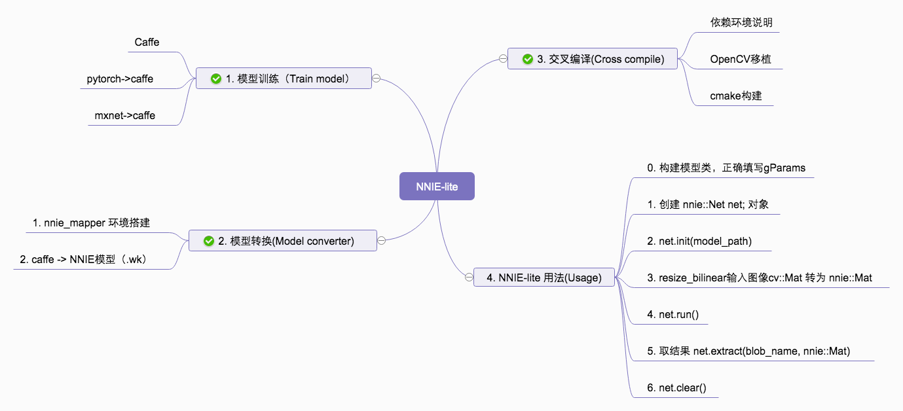

# NNIE-lite

⚡️ Using NNIE as simple as using ncnn ⚡️

Accelerate model's inference time on camera using NNIE.

NNIE 是 Neural Network Inference Engine 的简称，是海思媒体 SoC 中专门针对神经网络特别是深度学习卷积神经网络进行加速处理的硬件单元.

The project is more suitable for algorithm engineer who don't care about the underlying about NNIE's detail or camera system, you can just focus on your model's performance and latency.

===================================================================

## Introduce

-  CMake-Based Project 

- This project is straightforward to apply Hi3516CV500、Hi3519AV100

- Refactor NNIE by C++ &amp; OpenCV

--- 

## Environment

- Hisi SDK version

    - Hi3516CV500_SDK_V2.0.0.3

- Cross Tools

    - 32bit
    - arm-himix200-linux

Recommend to read **Related Blog** about more detail.

---

## Usage

- Model Converter

    - A template about converting Caffe_ENet to NNIE_ENet was provided.

- Deploy

    - The examples provided how to use general classification and general segmentaion.
    
        - Put MNIST as general classification example.
        - Put ENet as general segmentation example.
    
    - You may reference the examples to coding your custom task.

---

## Todo list

- [ ] ResNet 18
- [ ] MobileNetv2-yolov2
- [ ] MobileNetv2-yolov3
- [ ] CPM
- [ ] OpenPose

---

## Supported Model

- Classification

    - [x] LeNet 5

- Segmentation

    - [x] ENet 
        - train repo :[https://github.com/TimoSaemann/ENet](https://github.com/TimoSaemann/ENet)
        
    - [x] SegNet
        
- ObjectDetection

    - [ ] MobileNet-yolo-series
        - train repo :[https://github.com/eric612/MobileNet-YOLO](https://github.com/eric612/MobileNet-YOLO)

---

## Debug Conveniently

You may use ENet inference cityscapes image, and generate a color mask on camera directly.

A demo output like below and the model is just a toy with few epoch.

---

## Related Blog

- [Build environment for model converter](https://blog.csdn.net/racesu/article/details/107045858)

- [Cross compile OpenCV](https://blog.csdn.net/racesu/article/details/107047448)

---

## References

- [Tencent/ncnn](https://github.com/Tencent/ncnn)
 
- [yangfei963158659/nnie](https://github.com/yangfei963158659/nnie)

- [GenericClassificationTensorRTApi](https://github.com/RaySue/GenericClassificationTensorRTApi)

<!--## Donation

If you like this repository, or if you'd like to support the author for any reason, you can donate to the author. Feel free to send me your name or introducing pages, I will make sure your name(s) on the sponsors list.

-->

